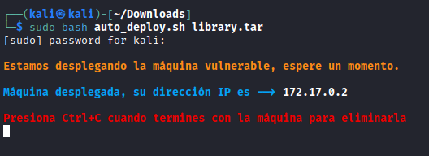
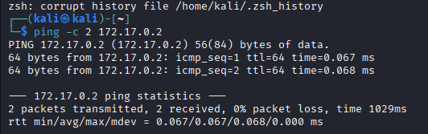
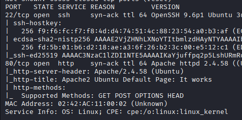
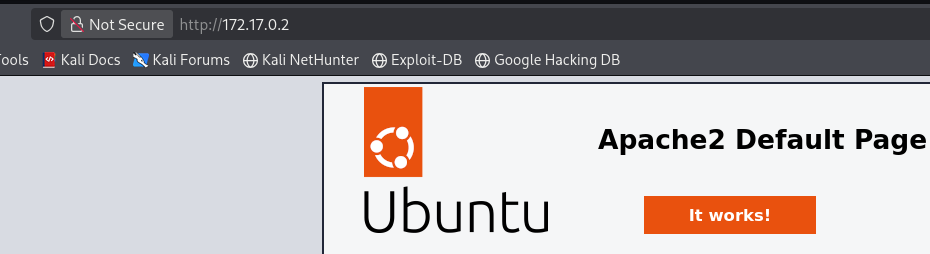
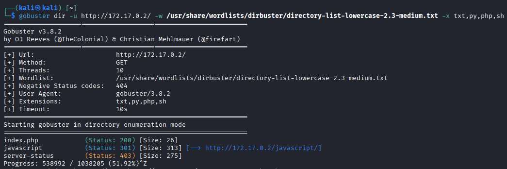
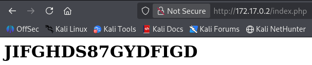
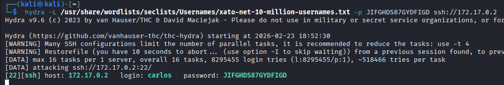
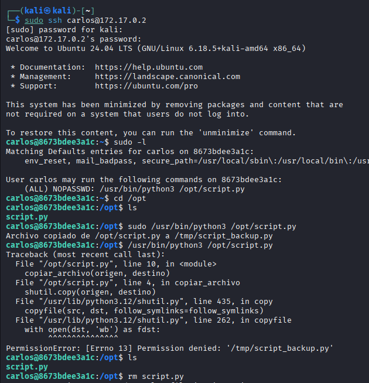
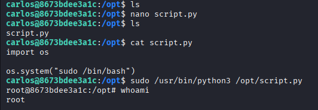

# Library - DockerLabs

 
## 📌 Información General

- **Nombre:** Library  
- **Dificultad:** Fácil  
- **Plataforma:** DockerLabs  

---

## 🔎 Reconocimiento y Enumeración

En este laboratorio se trabaja con la máquina Library, catalogada como de nivel fácil dentro de la plataforma DockerLabs.

---

Se realizó una prueba de conectividad utilizando el comando ping contra la máquina objetivo.  
El host respondió correctamente, confirmando que existe comunicación activa entre el atacante y el objetivo.  

Además, la respuesta mostró un valor TTL=64, lo cual es característico de sistemas basados en Linux/Unix. Este indicador permite realizar una identificación preliminar del sistema operativo del objetivo.

---

Se realiza un escaneo con Nmap, identificando los puertos 22 (SSH) y 80 (HTTP) como abiertos en la máquina objetivo.

---

## 🌐 Análisis del Servicio Web

Al acceder desde el navegador a la dirección IP del objetivo, se visualiza la página por defecto del servidor web Apache HTTP Server en un sistema Ubuntu, lo que confirma que el servicio HTTP está activo.

---

Se realiza un proceso de enumeración de directorios utilizando Gobuster, identificando el archivo index.php dentro del servidor web.

---

Al acceder a la ruta /index.php desde el navegador, se identifica lo que aparenta ser una credencial expuesta en texto plano, lo que podría representar una vulnerabilidad de divulgación de información sensible.

---

## 🔐 Acceso Inicial

Se llevó a cabo un ataque de fuerza bruta utilizando Hydra, logrando identificar el usuario válido carlos.

---

## 🚀 Escalada de Privilegios

Tras obtener acceso vía SSH, se enumeran privilegios con sudo -l, identificando la siguiente configuración: (ALL) NOPASSWD: /usr/bin/python3 /opt/script.py 

Esto indica que el usuario puede ejecutar el script especificado como root sin necesidad de contraseña.  

Se intentó ejecutar /usr/bin/python3 /opt/script.py tanto con privilegios elevados como sin ellos, obteniendo un acceso denegado. Dado que el binario permitido apunta a un script específico, se procede a eliminar y recrear script.py con el objetivo de aprovechar la configuración NOPASSWD para la escalada de privilegios.

---

Se crea un nuevo archivo script.py mediante el editor GNU nano. Tras verificar su contenido con cat, se confirma que el script está correctamente definido.  

Finalmente, se ejecuta el comando permitido: sudo /usr/bin/python3 /opt/script.py 
Al comprobar con whoami, se confirma la escalada exitosa de privilegios, obteniendo acceso como root.

